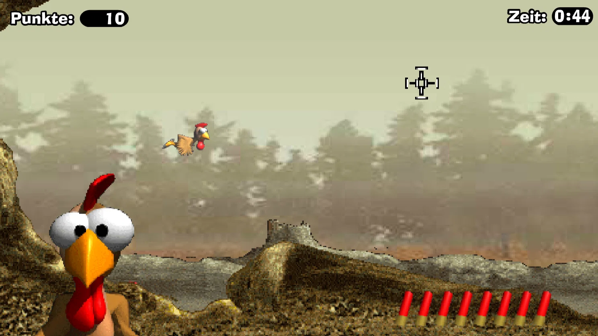

<p align="center">
  
</p>

---

Cooles Projekt 😄 – ich geb dir eine **strukturierte Anleitung + Denkanstöße**, aber keine komplette Lösung. Du baust es Schritt für Schritt selbst.

---

# 🐔 1. Grundidee klären

Bevor du Code schreibst, überleg:

* Was ist das Ziel?

  * Hühner erscheinen → Spieler klickt → Punkte
* Was brauchst du minimal?

  * Spielfeld (Browser)
  * bewegte Objekte (Hühner)
  * Klick-Logik
  * Punkte-System

👉 Frage für dich:
**Soll das Spiel zeitbasiert sein oder endlos laufen?**

---

# 🧱 2. Basis: HTML + Canvas

Du brauchst eine Fläche zum Zeichnen.

👉 Denk mal drüber nach:

* Nimmst du `<div>`s oder ein `<canvas>`?

💡 Tipp: Für Spiele → **Canvas ist viel einfacher für Bewegung**

---

# 🎮 3. Game Loop (das Herzstück)

Jedes Spiel braucht eine Schleife.

👉 Konzept:

* Aktualisieren (Positionen ändern)
* Zeichnen (alles neu rendern)
* Wiederholen (~60 FPS)

👉 Recherche-Stichwort:

* `requestAnimationFrame`

👉 Denkfrage:
**Warum sollte man nicht `setInterval` verwenden?**

---

# 🐓 4. Huhn als Objekt denken

Statt Chaos: strukturiere dein Spiel.

👉 Überleg:
Ein Huhn braucht z. B.:

* Position (x, y)
* Geschwindigkeit
* Bild
* Status (lebt / getroffen)

👉 Denkfrage:
**Machst du ein Objekt oder eine Klasse (`class Chicken`)? Warum?**

---

# 🏃 5. Bewegung

Jetzt wird’s spannend:

👉 Ideen:

* Hühner fliegen von links nach rechts
* oder erscheinen zufällig

👉 Mathe-Denkanstoß:

* Neue Position = alte Position + Geschwindigkeit

👉 Bonus:

* Zufällige Geschwindigkeit → `Math.random()`

---

# 🖱️ 6. Klick-Erkennung

Spieler soll Hühner treffen.

👉 Problem:
Wie erkennst du, ob ein Klick ein Huhn trifft?

👉 Denkansatz:

* Mausposition holen
* Prüfen: liegt sie im Bereich des Huhns?

👉 Stichwort:

* Bounding Box (Rechteck-Kollision)

---

# 💯 7. Punkte-System

Ganz simpel starten:

👉 Überleg:

* Variable `score`
* Wenn getroffen → erhöhen

👉 Denkfrage:
**Wo speicherst du den Score – global oder im Game-Objekt?**

---

# ⏱️ 8. Schwierigkeit steigern

Wenn alles läuft:

👉 Ideen:

* Mehr Hühner
* Schnellere Bewegung
* Zeitlimit

---

# 🎨 9. Grafik & Feeling

Am Anfang:

* einfache Kreise statt Bilder

Später:

* PNGs für Hühner
* Soundeffekte

---

# 🧠 Mini-Architektur (ohne Code)

Denk dein Spiel so:

```
Game
 ├── chickens[]
 ├── score
 ├── update()
 ├── draw()
 └── handleClick()
```

---

# 🚀 Dein nächster Schritt

Starte ganz klein:

1. Canvas anzeigen
2. EIN Huhn zeichnen
3. Es bewegen
4. Klick erkennen

👉 Danach erst mehrere Hühner!

---

Wenn du willst, kannst du mir deinen ersten Code zeigen – ich geb dir dann gezielte Hinweise, ohne dir die Lösung vorwegzunehmen 👍
